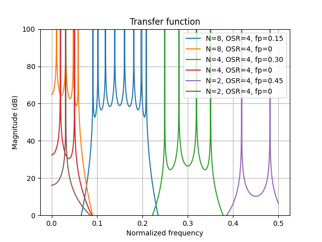

# A Control-Bounded Quadrature Leapfrog ADC
This repository contains the simulation code for the parper [A Control-Bounded Quadrature Leapfrog ADC][paper].

## Install

### Virtual Python Enviroment
To run the code it's reccomended to first create a fresh virutal python enviroment as
``` zsh
python3 -m venv venv
```
to activate the enviroment type
``` zsh
source venv/bin/activate
```
to deactivate type
``` zsh
deactivate
```

### Install dependencies
All package requirements are listed in the [requirements.txt](./requirements.txt) file.
To install them simply type
``` zsh
python -m pip install -r requirements.txt
```

## Simulations
Next follows details on how to execute and resulting files for each simulation from the [paper][paper].
The simulations are presented in connection to the figures which they ultimately generated.

### Fig. 10: Transfer functions
The transfer functions where generated using the [./transfer_function.py](./transfer_function.py) script.
To execute it type
```zsh
python transfer_function.py
```
The script generates a csv file [./csv/transfer_functions.csv](./csv/transfer_functions.csv) which was plotted using the 
[pgfplots](https://ctan.org/pkg/pgfplots) framework in the LaTex document. In addition, the script generate the matplotlib plot [./figures/transfer_functions.py](./figures/transfer_function.png).



### Fig. 11: Power Spectral Densities

### Fig. 12: Excess Loop Delay

### Fig. 13: Component Variations

### Fig. 15 and Fig. 16: Opamp Implemenation


[paper]: https://arxiv.org/abs/2211.06745