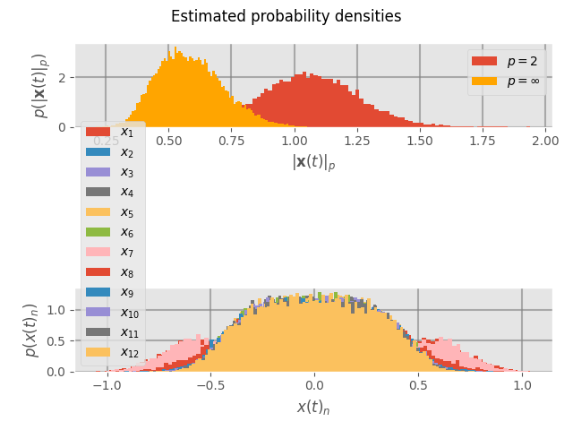
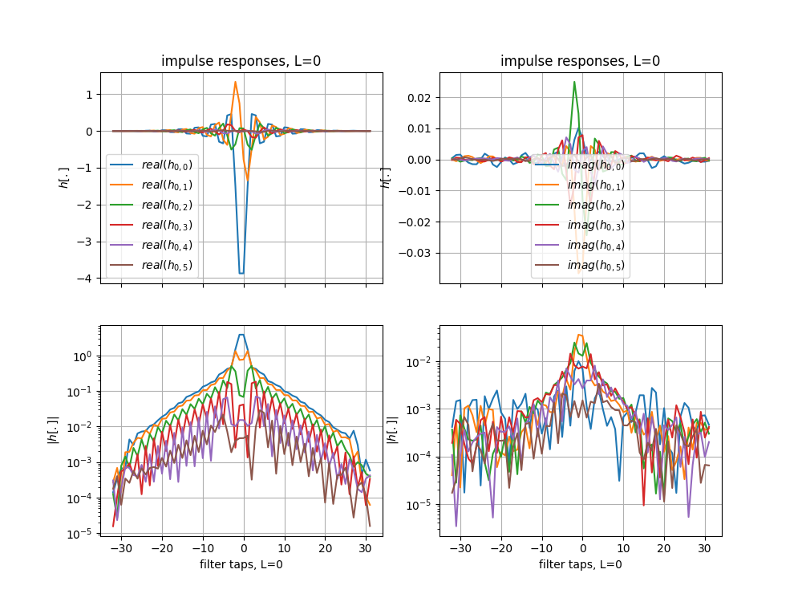

# A Control-Bounded Quadrature Leapfrog ADC
This repository contains the simulation code for the paper A Control-Bounded Quadrature Leapfrog ADC[paper].

## Install
To execute the code requires 
- `python3.8` or newer, 
- git, 
- [ngspice] (alternatively [docker]) 
- and optionally [GNU Parallel]

to be installed on your machine.

### Virtual Python Environment
To run the code, it's recommended to first create a fresh virtual python environment as
``` zsh
python -m venv venv
```
to activate the environmental type
``` zsh
source venv/bin/activate
```
to deactivate type
``` zsh
deactivate
```

### Install dependencies
All package requirements are listed in the [requirements.txt](./requirements.txt) file.
To install them simply type
``` zsh
python -m pip install -r requirements.txt
```

#### Optional
In case you want to use the parallel execution mode of [simset] make sure to also install [GNU Parallel]. 

## Simulations
Next are details for executing and the resulting files for each simulation from the [paper].
The simulations are presented in connection to the figures which they ultimately generated.

### Fig. 10: Transfer functions
The transfer functions were generated using the [./transfer_function.py](./transfer_function.py) script.
To execute it, type
```zsh
python transfer_function.py
```
The script generates a CSV file [./csv[/tranfer_function/transfer_functions.csv](./csv/transfer_function/transfer_functions.csv), which was plotted using the [pgfplots] framework in the LaTex source file for the [paper]. In addition, the script generates the matplotlib plot [./figures/transfer_function/transfer_functions.png](./figures/transfer_function/transfer_function.png).


### Fig. 11: Power Spectral Densities
The power spectral density related simulations can be found in the [./psd.py](./psd.py) script.
As the file contains several parameter sweeps, we have used the [simset] package to orchestrate this. 
This slightly obscures the execution commands as we now type the following
```zsh
python psd.py simulate setup local
./bash_scripts/local_simulation.sh
python psd.py process
```
to execute the simulations.

Alternatively, for parallel execution, type
```zsh
python psd.py simulate setup parallel
./bash_scripts/parallel_simulation.sh
python psd.py process
```
Note that this requires the [GNU parallel] to be installed; see [Optional install](#optional-optional-install) Section.](#optional-optional-install). Additionally, for parallel execution, take note of the 
```python
simset.concurrent_jobs = 48
```
setting in the [./psd.py](./psd.py) file.

#### Results
The script generates several CSV files and PNG figures. The CSV files contain the date used for plotting Fig. 11, using [pgfplots], in the [paper]. Specifically,
- [./csv/psd/psd_8_4](./csv/psd/psd_8_4.csv), 
- [./csv/psd/psd_6_4](./csv/psd/psd_6_4.csv),
- and [./csv/psd/psd_6_8](./csv/psd/psd_6_8.csv),

contains the PSD data whereas [./csv/psd/snr_8_4.csv](./csv/psd/snr_8_4.csv), [./csv/psd/snr_6_4.csv](./csv/psd/snr_6_4.csv), and [./csv/psd/snr_6_8.csv](./csv/psd/snr_6_8.csv) correspond to the evaluated SNRs.

The resulting figures can be found in [./figures/psd/](./figures/psd/) and contains PSD plots, SNR plots, state evolution plots, the final estimate in time-domain, and more. Some highlights follow below

##### PSDs


### Fig. 12: Excess Loop Delay

There are two different excess loop delay simulations:
1) where we assume to know the excess delay
2) where the assumed excess delay is fixed

We proceed by describing these two scenarios sequentially.

#### Known Excess Loop Delay
In the first case, the simulations are contained in [./excess_loop_delay_variable.py](./excess_loop_delay_variable.py).
As in the case of [the power spectral density simulations](#fig-11-power-spectral-densities), we use [simset] for the parameter sweeps and are therefore executed as
```zsh
python excess_loop_delay_variable.py simulate setup local
./bash_scripts/local_simulation.sh
python excess_loop_delay_variable.py process
```
to execute the simulations.

Alternatively, for parallel execution, type
```zsh
python excess_loop_delay_variable.py simulate setup parallel
./bash_scripts/parallel_simulation.sh
python excess_loop_delay_variable.py process
```

##### Results
The simulations generate two LaTex document 
- [./tex/excess_loop_delay_variable/L2_and_L_infty_norm.tex](./tex/excess_loop_delay_variable/L2_and_L_infty_norm.tex) 
- and [./tex/excess_loop_delay_variable/SNR.tex](./tex/excess_loop_delay_variable/SNR.tex)

which is the starting point for Fig. 12 in the [paper].

Additionally, bode plots, state distribution, control signal distribution, PSD, filter impulse response, and time evolution of estimate are given in the [./figures/excess_loop_delay_variable/)](./figures/excess_loop_delay_variable/) directory. Next follows some highlights for excess loop delay = 0.08...

PSD:


States time evolution:


States histogram



Bode plot


Impulse response 


#### Fixed Excess Loop Delay
In the second case, the simulations are contained in [./excess_loop_delay_fixed.py](./excess_loop_delay_fixed.py) and are executed by typing
```zsh
python excess_loop_delay_fixed.py simulate setup local
./bash_scripts/local_simulation.sh
python excess_loop_delay_fixed.py process
```
to execute the simulations.

Alternatively, for parallel execution, type
```zsh
python excess_loop_delay_fixed.py simulate setup parallel
./bash_scripts/parallel_simulation.sh
python excess_loop_delay_fixed.py process
```

##### Results
The simulations generate LaTex documents, located in [./tex/excess_loop_delay_fixed/](./tex/excess_loop_delay_fixed/), which is the starting point for Fig. 12 in the [paper].

Additionally, bode plots, state distribution, control signal distribution, PSD, filter impulse response, and time evolution of estimate are given in the [./figures/excess_loop_delay_fixed)](./figures/excess_loop_delay_fixed/) directory.

### Fig. 13: Component Variations
As this plot was generated with proprietary software, we are not able to share the full source code.

### Fig. 15 and Fig. 16: Opamp Implementation
The opamp implementation uses ngspice for circuit-level simulations. In addition, the [cbacd] toolbox is leveraged to generate spice netlist from the high-level models as used in the prior simulations. To execute these simulation type

Alternatively, in case you don't have ngspice installed on your machine, you could use a docker image as
```zsh
sudo docker run -it --rm -v $(pwd):/home/jovyan ghcr.io/hammal/cbadc:develop ./docker_bash.sh
```
which will run [./docker_bash.sh](./docker_bash.sh) inside the image.

#### Results
The simulations result in the CSV files 
- [./csv/opamp/]Which contains the data used for plotting, using [pgfplots], in Fig. 15 and Fig. 16, respectively.
In addition, you find various related visualizations in the folder.

As previously mentioned, each parametrization results in a generated spice netlist, which can be found in the [./opamp/netlist](./opamp/netlist/) folder.
See, for example, this file [./opamp/netlist/rc_train_opamp_N_6_OSR=4_GBWP=2.4e+01_DC_gain=5.0e+02_fp_fs_0.31.cir](./opamp/netlist/rc_train_opamp_N_6_OSR=4_GBWP=2.4e+01_DC_gain=5.0e+02_fp_fs_0.31.cir).

Finally, a number of helpful PNG files are generated in [./csv/opamp/](./figures/opamp/) folder. We show some highlights for GBWP=750, DC_gain=500 below:

GBWP plot


PSD


Filter impulse response



Filter Bode plot


## Simset
[Simset][simset] is used as a convenience for orchestrating the various parameter sweeps.
Some useful commands when using [simset] are:

#### Print status, i.e., the number of successful and unsuccessful simulations for a given file
```zsh
python python_script_using_simset.py info
```
#### Clean directory from all simset simulation files
```zsh
simset clean
```
Note that [simset] will create utility files as part of its operations; these files are confined in the [.data](./data), [./bash_scripts](./bash_scripts/), [./local](./local/), and [.parallel](./parallel/) directories.

[paper]: https://arxiv.org/abs/2211.06745
[simset]: https://github.com/hammal/simset
[GNU Parallel]: https://www.gnu.org/software/parallel/
[pgfplots]: https://ctan.org/pkg/pgfplots
[ngspice]: https://ngspice.sourceforge.io
[docker]: https://www.docker.com
[cbadc]: https://github.com/hammal/cbadc